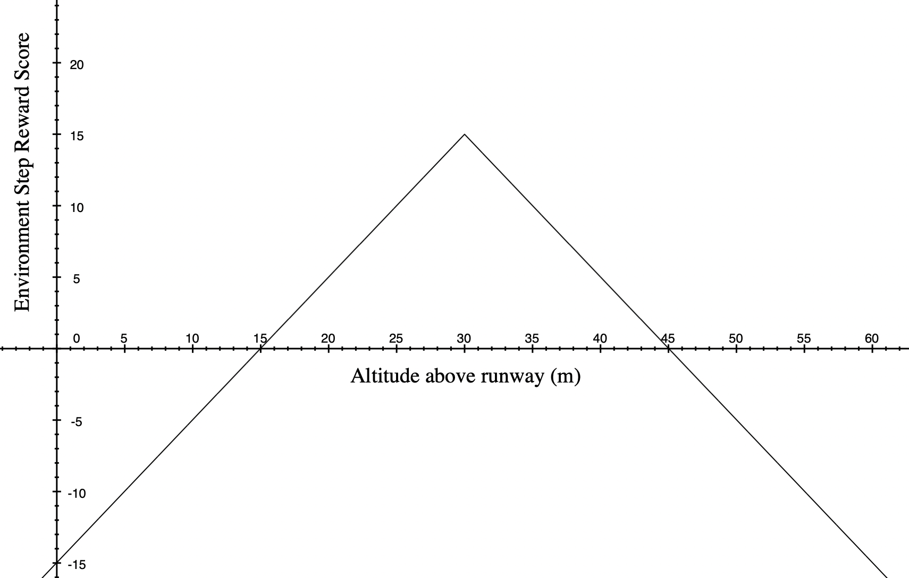
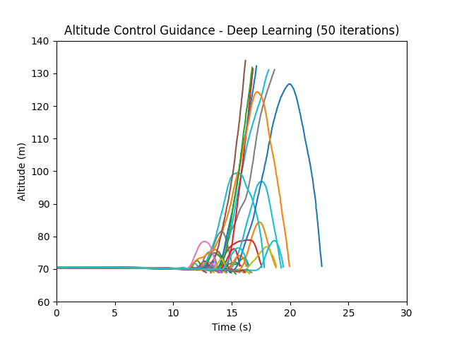
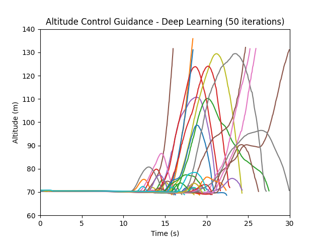

# Continuous Proximal Policy Optimization 
## Objective
This project aims to train a continuous ppo, a reinforcement learning model, to control the pitch authority of an aircraft in the popular aerospace simulator, Kerbal Space Program. The goal is to train the model such that it can pilot the aircraft to take-off from the runway, and maintain a reasonable altitude without going out of bounds for 30 seconds. The gradual improvement in pitch control achieved after many hours of training is documented below.

#### Dependencies
This project uses the following python libraries:
- pytorch: for developing and training neural networks
- krpc: for programmatic control of aircraft in the aerospace simulation software

## Technical Overview
The following is a very high-level explanation of the reinforcement learning methods and practices used in this project.
#### Actor-Critic Networks
Actor-Critic networks are a pair of two distinct neural networks which operate in tandem to optimize the training protocol. Both networks receive the same inputs, their distinction is defined by what they output:
- The Actor network outputs the chosen action of the reinforcement learning model
- The Critic network outputs an evaluation of the previous action taken by the Actor network

There are many reinforcement learning models which train Actor-Critic networks, one of which is Proximal Policy Optimization (PPO)
#### Proximal Policy Optimization (PPO)
PPO's are a reinforcement learning algorithm which aim to improve upon a common weakness of Actor-Critic networks: being highly sensitive to perturbations or massive overcorrections in learned changes to policy. This can cause premature convergence onto a policy, where the networks gets stuck and continually chooses the same action (often a very incorrect action).

PPO's attempt to avoid perturbations by limiting the number of updates to the networks. Updates are done less frequently, and more comprehensively by training with several averaged data samples in a process called mini-batch stochastic gradient ascent.

Another technique used in the implementation of PPO in this project is refining the hyperparameter known as the entropy coefficient.

#### Entropy Regularization
As previously stated, a common problem in deep reinforcement learning is premature policy convergence, and this project was no exception. Sufficiently raising the model's entropy coefficient was essential in having the model continue to explore different trajectories and learn from them, over the thousands of training sessions.

## Continuous PPO
Both the Actor and Critic neural networks in this project are comprised of an input layer, two hidden layers, and an output layer. This PPO is defined as "continuous" (as opposed to "discrete"), because its action (output) is a float value (0,1) instead of an integer. 

The Actor network's input and output layers were defined respectively:
- Observation Space: [speed, altitude, vertical velocity]
- Action Space: [float] [0,1) controls aircraft pitch
#### Methodology
In between the training environment's simulation steps, the model gets a new array of observations, chooses an action, and intermittently takes a sample of the previous few steps of data and learns. This repeats until the end of the training iteration.

### Training Environment
The training environment is designed via programmatic access to an aerospace simulator, where training iterations each last a maximum 30 seconds. There are several out-of-bounds conditions which immediately terminate the training iteration. The training environment begins with the aircraft on the runway with no speed. A conventional control algorithm gets the aircraft to throttle up and then maintain a target speed. The only control decision made by the PPO is the pitch authority. The tear-down and restart of training environment happens programmatically between training sessions.
#### Environment Start
The training environment uses numeric methods to handle control authority updates and new observations. Initial observations are returned to the model.
#### Environment Step
Each simulation step duration is defined by a minimum value in the class constructor: `self.t = time_step`. Each environment step does the following in order:
- makes pitch adjustment based on action chosen by model
- defines the numeric differential value `self.t` based on how much time has passed since the last step and, if necessary, allows time to pass
- makes throttle adjustment with conventional control methods to maintain constant aircraft speed
- calculates a new observation array
- appends reward points to reward score
- checks for training session termination conditions
- returns observation array, reward score, and done boolean

#### Reward Function
The reward function decides the reward given to the previously chosen action of the model based on the current altitude of the aircraft. Greater rewards were given to the target altitude of about 30m above the runway and scaled linearly (the runway is at about 70m above sea-level). The following plot depicts reward function used for training this model:

  

#### Termination Conditions
The following are the termination conditions for the training session. These conditions were carefully chosen over multiple attempts to encourage the model to learn. Most termination conditions were accompanied by a large punishment to the model (a negative reward).
- Aircraft crashes or otherwise becomes inoperable
- Failing to take-off in a safe manner
- Flying too high, past a defined out-of-bounds ceiling
- Environment reaches training session's max runtime of 30 seconds (no punishment for this condition)

## Results
There was observable evidence that learning had occurred after the +1,000 training sessions that were run for this project. Though rare, the aircraft sometimes did remain in a stable take-off / flight trajectory for the entire duration of the 30-second training session. The frequency of these occurrences would noticeably increase over the course of training the model, which was certainly encouraging. 

The following plots show some of this progression:
#### Training Sessions 200-250
In this plot we can see that aircraft trajectories are fairly polarized: Either immediately failing to take off, or flying straight up nearly vertically. There's no evidence that the model has learned any of the nuances of flight and altitude control.

  

#### Training Sessions 1,150-1,200
This next plot looks a lot different. Clearly far from perfect, but there are many trajectories which indicate strong attempts at stabilizing the aircraft's altitude. There are even a couple flight paths which end at the 30-second mark, demonstrating that the model was able to keep the aircraft airborne until the end of the training session.

  

## Conclusion
The results of this project were only possible after many iterations of refactoring and revising the learning algorithm, hyperparameters, and training environment. Hopefully these results demonstrate the accessibility of deep learning models and training A.I. in the context of autonomous control.
